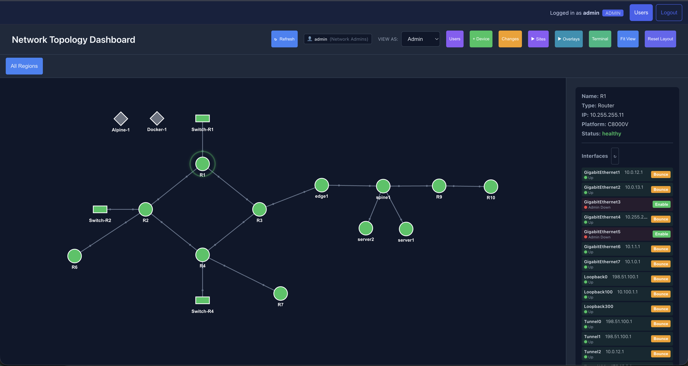
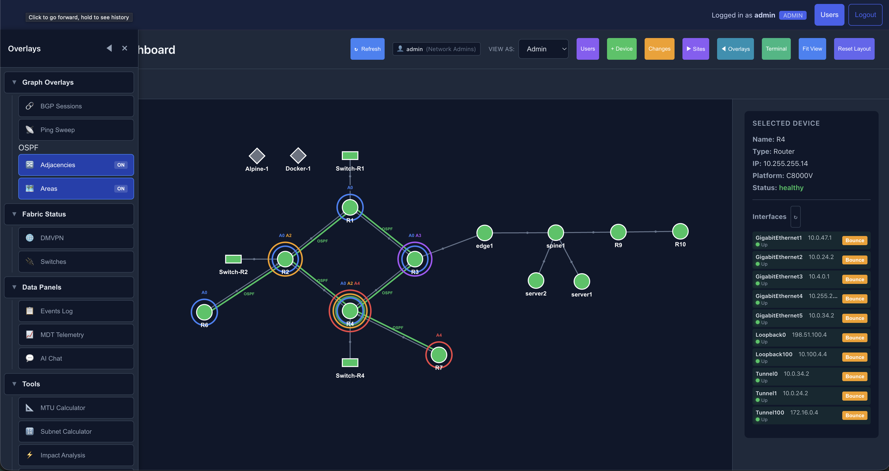
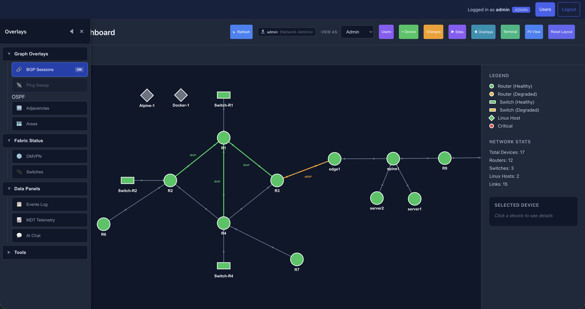
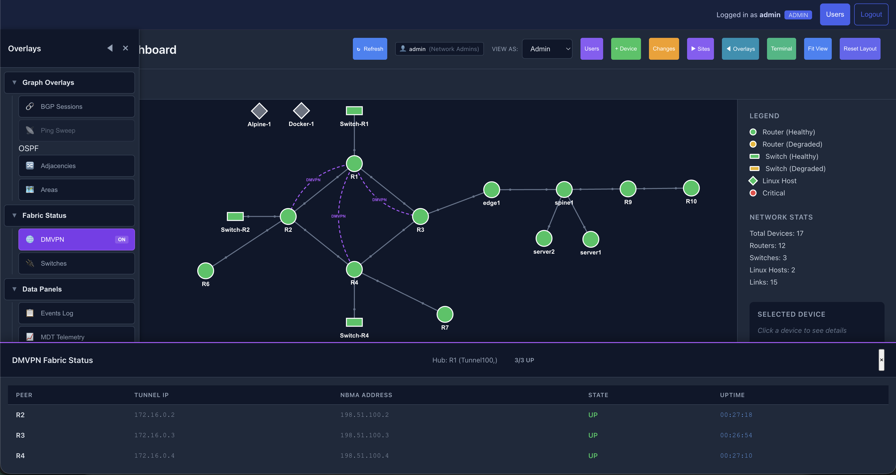
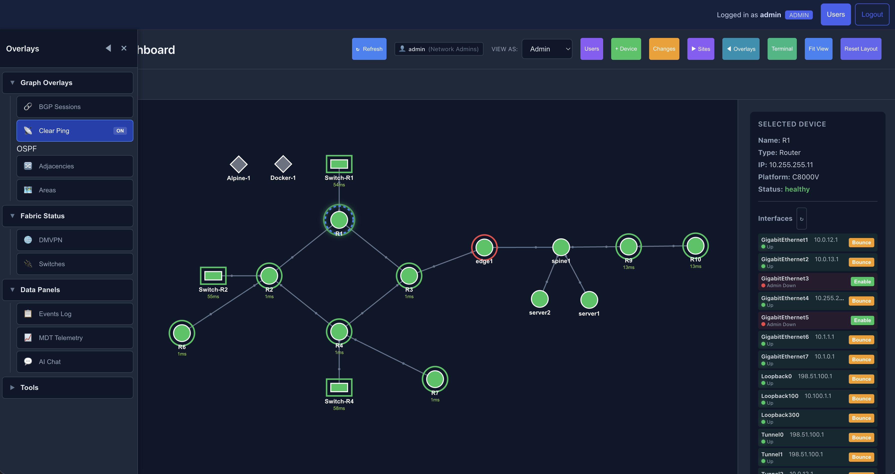
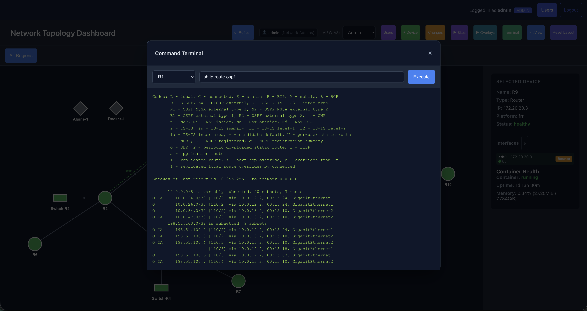
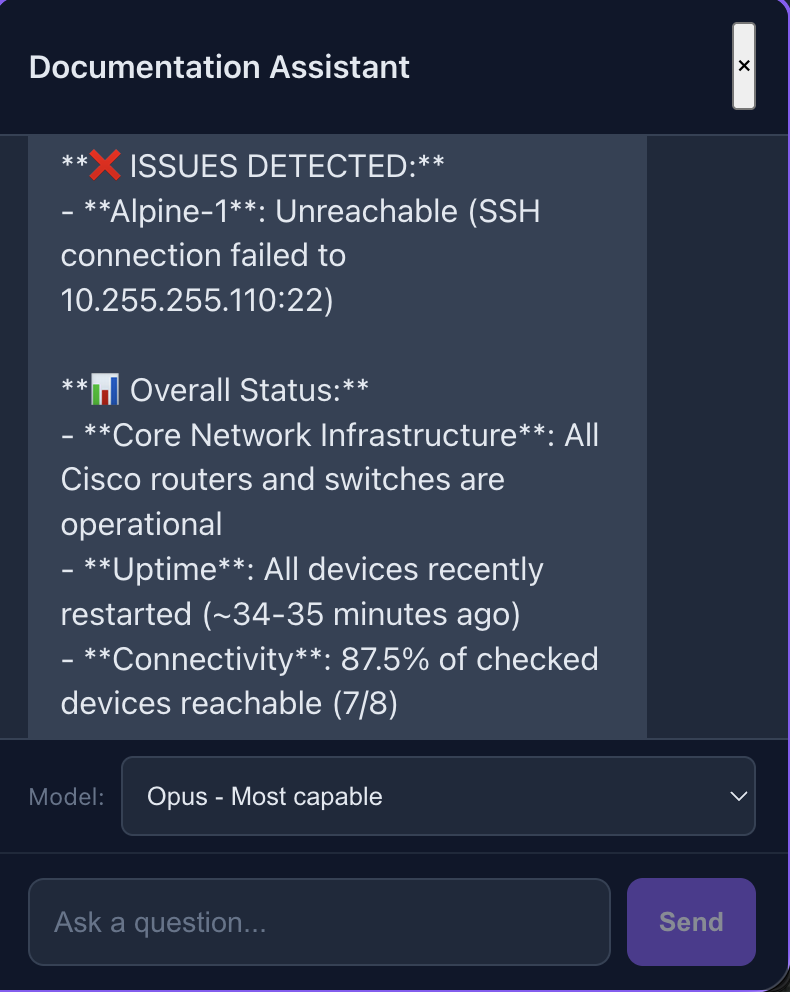
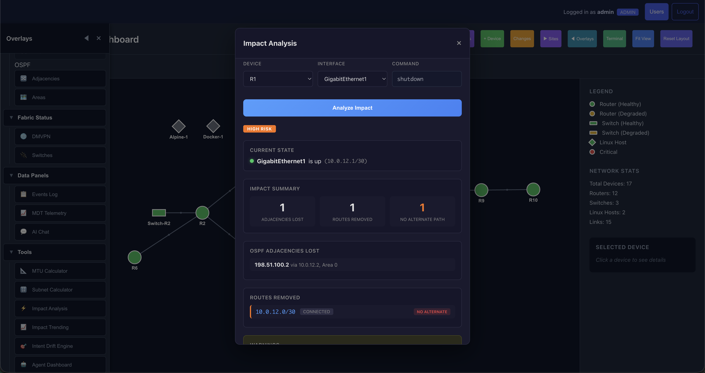
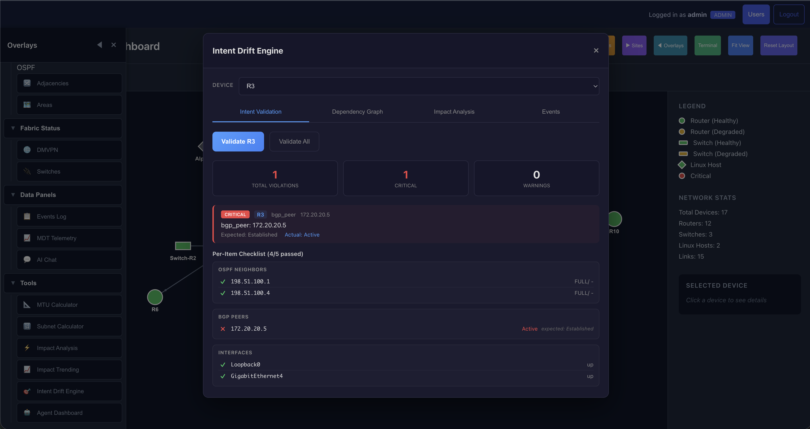

# NetworkOps
[](https://github.com/E-Conners-Lab/NetworkOps_Platform/releases)
[](https://www.python.org/downloads/)
[](https://modelcontextprotocol.io/)

**AI-Powered Network Automation Platform**

> Natural language commands to manage multi-vendor infrastructure

NetworkOps is a network automation platform built on the Model Context Protocol (MCP). It enables AI-assisted management of Cisco, Juniper, Nokia, Arista, and Linux devices through natural language — no scripting required.

---

## Screenshots

### Topology Dashboard
Interactive force-directed network topology with device health indicators, legend, and network stats.


### Device Details
Click any device to view its properties, interface status, and remediation controls.



### OSPF Adjacencies Overlay
Visualize OSPF adjacencies with area labels directly on topology links.



### BGP Sessions Overlay
BGP session status with AS number annotations on peering links.



### DMVPN Fabric Status
DMVPN hub-and-spoke overlay with peer state table showing tunnel IPs, NBMA addresses, and uptime.



### Ping Sweep with Latency Heatmap
Bulk ping results visualized as a color-coded latency heatmap across the topology.



### Command Terminal
Execute show commands on any device with full output display.



### AI Documentation Assistant
RAG-powered chat with live network queries — ask questions in natural language and get answers with source citations.



### Real-time Telemetry (MDT)
Live CPU, memory, interface traffic, and counters streamed via gRPC at 5-second intervals.


### Impact Analysis
Predict the blast radius of a configuration change before executing it.



### Intent Drift Engine
YAML-defined expected state validation with per-item compliance checks and violation alerts.



### Subnet Calculator
Built-in subnet calculator with VLSM split and quick reference tables.


---

## Quick Start

### Demo Mode (no network devices needed)

Try NetworkOps without any hardware. Demo mode simulates a multi-device network with routers, switches, and an FRR edge device.

```bash
git clone https://github.com/E-Conners-Lab/NetworkOps_Platform.git && cd NetworkOps_Platform
./scripts/quickstart.sh --demo
# Follow the prompts, then open http://localhost:5001 — Login: admin/admin
```

Or manually:

```bash
git clone https://github.com/E-Conners-Lab/NetworkOps_Platform.git && cd NetworkOps_Platform
python3 -m venv .venv && source .venv/bin/activate
pip install -r requirements.txt        # or: uv pip install -r requirements.txt
cd dashboard && npm install && npm run build && cd ..
JWT_SECRET=$(python3 -c "import secrets; print(secrets.token_hex(32))")
DEMO_MODE=true JWT_SECRET=$JWT_SECRET python dashboard/api_server.py
```

### With Real Devices

```bash
git clone https://github.com/E-Conners-Lab/NetworkOps_Platform.git && cd NetworkOps_Platform
./scripts/quickstart.sh
# Edit .env with your device IPs and credentials
# Edit config/devices.py with your device inventory
python dashboard/api_server.py
```

### Docker

```bash
git clone https://github.com/E-Conners-Lab/NetworkOps_Platform.git && cd NetworkOps_Platform
./scripts/docker-init.sh
# Edit .env with your credentials (or add DEMO_MODE=true for demo)
docker compose up
```

---

## Demo Mode

Demo mode provides a fully functional dashboard experience using simulated network data. No real devices, SSH connections, or lab infrastructure required.

### What Works in Demo Mode

| Feature | Status | Details |
|---------|--------|---------|
| **Topology visualization** | Full | 7-node network with routers, switches, and FRR edge device |
| **BGP overlay** | Full | Simulated iBGP (AS 65000) and eBGP (AS 65100) peering |
| **OSPF overlay** | Full | Area 0 adjacencies across all routers |
| **DMVPN overlay** | Full | Hub-and-spoke topology with 3 spokes |
| **Switch fabric overlay** | Full | 2 switches with uplink status and port counts |
| **Ping sweep** | Full | Simulated 100% reachability with realistic latencies |
| **Interface list** | Full | Per-device interface display with status |
| **Show commands** | Partial | `show ip interface brief`, `show version`, `show ip route` return simulated output; other commands return a placeholder message |
| **Login / RBAC** | Full | JWT auth, role-based permissions, all dashboard features unlocked |
| **Health endpoints** | Full | `/healthz` and `/health/detailed` work without Redis |

### What Does Not Work in Demo Mode

| Feature | Reason |
|---------|--------|
| **Configuration changes** | No real devices to push config to |
| **NETCONF/YANG queries** | Requires live device connections |
| **pyATS baselines/diffs** | Requires SSH to real devices |
| **RAG chatbot** | Requires `ANTHROPIC_API_KEY` and ChromaDB index |
| **Streaming telemetry** | Requires gRPC streams from real devices |
| **Terminal (arbitrary commands)** | Most commands return placeholder output |
| **NetBox integration** | Requires a running NetBox instance |
| **MCP tools via Claude** | Tools that SSH to devices will fail; read-only tools work |

### Demo Topology

```
        R1 ──── R2
        │        │
   Switch-R1  Switch-R2
        │
        R3 ──── R4
        │
      edge1 (FRR, AS 65100)
```

- **R1–R4**: Cisco C8000V routers (IOS-XE) — OSPF Area 0, iBGP AS 65000, DMVPN hub/spoke
- **Switch-R1, Switch-R2**: Cisco Cat9kv switches
- **edge1**: FRRouting device — eBGP peering with R3

---

## Features

### React Dashboard
- Interactive force-directed topology with drag-and-drop positioning
- Real-time device health monitoring (healthy / degraded / critical)
- Role-based access control (Admin / Operator / Viewer)
- Command terminal with output display
- AI chat panel (RAG-powered, requires Anthropic API key)
- Device detail panels:
  - Cisco devices: Interface list with admin/line protocol status, remediation buttons
  - Linux hosts: Uptime, memory, disk, gateway reachability
  - Containerlab devices: Container status, uptime, memory
- Visualization overlays:
  - BGP session status with AS numbers
  - OSPF adjacencies with area mapping
  - DMVPN hub/spoke fabric
  - Switch fabric with EIGRP status
  - Ping sweep with latency heatmap
- Intent Drift Engine:
  - YAML-defined expected state validation
  - Force-directed dependency graph
  - Forward/backward/blast-radius impact analysis
  - Cross-subsystem event correlation
- Hierarchical site view (Region → Site → Rack → Device)
- Position persistence via localStorage
- Change management workflow

### MCP Tools (178 tools, 24 categories)

Integrate with Claude Code or Claude Desktop for natural language network management.

#### Health & Monitoring
| Tool | Description |
|------|-------------|
| `health_check` | Check single device connectivity |
| `health_check_all` | Parallel health check across all devices |
| `full_network_test` | Validate OSPF, BGP, DMVPN, and reachability |
| `linux_health_check` | Linux host status (uptime, memory, disk) |
| `get_cpu_memory` | CPU and memory utilization |
| `ping_sweep` | Bulk ping from a device to all targets |

#### Device Operations
| Tool | Description |
|------|-------------|
| `get_devices` | List available devices |
| `send_command` | Execute show commands |
| `send_config` | Send configuration commands |
| `discover_topology` | Discover topology via CDP/LLDP |
| `get_interface_status` | Detailed interface status |
| `remediate_interface` | Fix interfaces (no shutdown, bounce) |
| `bulk_command` | Execute command on multiple devices in parallel |

#### Configuration Management
| Tool | Description |
|------|-------------|
| `backup_config` | Save running config to timestamped file |
| `compare_configs` | Diff two configs or backup files |
| `list_backups` | List saved configuration backups |

#### Routing & Troubleshooting
| Tool | Description |
|------|-------------|
| `get_routing_table` | Parsed routing table with protocol filtering |
| `traceroute` | Hop-by-hop path analysis |
| `get_arp_table` | Parsed ARP table with VRF support |
| `get_mac_table` | MAC address table from switches |
| `get_neighbors` | Structured CDP/LLDP neighbor data |
| `get_logs` | Syslog buffer with severity filtering |

#### NETCONF
| Tool | Description |
|------|-------------|
| `get_interfaces_netconf` | Interface info via NETCONF/YANG |
| `get_netconf_capabilities` | Device NETCONF capabilities |
| `get_bgp_neighbors_netconf` | BGP neighbors via NETCONF |

#### pyATS Integration
| Tool | Description |
|------|-------------|
| `pyats_learn_feature` | Learn device feature state |
| `pyats_snapshot_state` | Capture device state baseline |
| `pyats_diff_state` | Compare against baseline |
| `pyats_check_compliance` | Check config against golden templates |
| `pyats_list_baselines` | List saved baselines |
| `pyats_list_templates` | List golden config templates |

#### NetBox Integration
| Tool | Description |
|------|-------------|
| `netbox_get_devices` | List devices from NetBox |
| `netbox_get_interfaces` | Device interfaces from NetBox |
| `netbox_get_prefixes` | IP prefixes from NetBox |
| `netbox_generate_configs` | Generate FRR configs from NetBox via Jinja2 |
| `netbox_generate_iosxe_config` | Generate IOS-XE configs from NetBox |
| `netbox_allocate_ip` | Allocate next available IP from a prefix |

#### Memory & Context System
| Tool | Description |
|------|-------------|
| `memory_search` | Semantic search across conversation history |
| `memory_save` | Save notes for later retrieval |
| `memory_recall_device` | Recent events for a device |
| `memory_stats` | Memory system statistics |

#### Event Logging & Cache
| Tool | Description |
|------|-------------|
| `get_event_log` | Audit log events (filterable) |
| `clear_event_log` | Clear audit log |
| `cache_status` | Redis cache statistics |

### Streaming Telemetry (MDT)
- Real-time CPU, memory, and interface counters via gRPC (5-second intervals)
- WebSocket push to dashboard via Socket.IO
- Configured on C8000V routers and Cat9kv switches

### RAG Documentation Chatbot
- Indexed CCIE/Cisco documentation with semantic search
- ChromaDB + sentence-transformers embeddings
- Live network queries via SSH during chat
- Claude-powered responses with source citations

### Discord Bot (ChatOps)
- Commands: `!devices`, `!health`, `!bgp`, `!ping`, `!events`, `!topology`, `!run`
- RBAC: Admin commands require "Network Admin" role

### Enterprise Features

| Category | Feature |
|----------|---------|
| **Authentication** | JWT tokens, MFA/TOTP with recovery codes |
| **Authorization** | Role-based access control (Admin/Operator/Viewer) |
| **Caching** | Redis-backed response caching |
| **Rate Limiting** | Configurable per-endpoint rate limits |
| **Async Jobs** | Celery task queue with PostgreSQL persistence |
| **Health Probes** | `/healthz`, `/readyz`, `/health/detailed`, `/metrics` |
| **TLS/HTTPS** | Nginx reverse proxy with TLS 1.2/1.3 |
| **Logging** | Structured JSON logs for aggregation |
| **SIEM Forwarding** | Splunk, Elasticsearch, Syslog, Webhook |
| **Kubernetes** | Full manifests with HPA, PDB, rolling deployments |
| **Graceful Shutdown** | SIGTERM handling with request draining |

---

## Architecture

```
┌─────────────────────────────────────────────────────────────────────┐
│                        NetworkOps Platform                          │
├─────────────────────────────────────────────────────────────────────┤
│                                                                     │
│   ┌──────────────┐    ┌──────────────┐    ┌────────────────────┐   │
│   │   Frontend   │    │  API Server  │    │    MCP Server      │   │
│   │   (React)    │◄──►│   (Flask)    │    │  (Claude Tools)    │   │
│   │  Port 3000   │    │  Port 5001   │    │                    │   │
│   │              │    │              │    │  178 tools across  │   │
│   │  • Topology  │    │  • REST API  │    │  24 categories     │   │
│   │  • Terminal  │    │  • WebSocket │    │  • NETCONF/YANG    │   │
│   │  • RAG Chat  │    │  • Auth/RBAC │    │  • pyATS           │   │
│   └──────────────┘    └──────┬───────┘    └──────────┬─────────┘   │
│                              │                       │              │
│                 ┌────────────┴───────────────────────┴──────────┐  │
│                 │             Shared Data Layer                  │  │
│                 │  • networkops.db (Alembic-managed)             │  │
│                 │  • chromadb/ (RAG)    • baselines/ (pyATS)     │  │
│                 └───────────────────────┬───────────────────────┘  │
│                                         │                          │
├─────────────────────────────────────────┼──────────────────────────┤
│                                         │                          │
│              Network Devices (SSH / NETCONF)                       │
│   ┌─────────┐  ┌─────────┐  ┌─────────┐  ┌─────────┐  ┌───────┐ │
│   │ Cisco   │  │ Juniper │  │ Nokia   │  │ Arista  │  │ Linux │ │
│   │ IOS-XE  │  │ Junos   │  │ SR Linux│  │  EOS    │  │ FRR   │ │
│   └─────────┘  └─────────┘  └─────────┘  └─────────┘  └───────┘ │
└─────────────────────────────────────────────────────────────────────┘
```

---

## Setting Up Your Own Lab

Use the quickstart script to configure NetworkOps for your own network devices:

```bash
# Interactive setup (recommended)
./scripts/quickstart.sh

# Demo mode (no devices needed)
./scripts/quickstart.sh --demo

# Non-interactive (CI/CD, Docker)
./scripts/quickstart.sh --headless

# Setup and auto-start
./scripts/quickstart.sh --headless --auto-start
```

The script detects [uv](https://docs.astral.sh/uv/) automatically for faster dependency installation.

### Supported Device Types

| Platform | `device_type` | Features |
|----------|---------------|----------|
| Cisco IOS-XE | `cisco_xe` | SSH, NETCONF, pyATS |
| Cisco IOS | `cisco_ios` | SSH only |
| Linux | `linux` | SSH |
| FRRouting | `containerlab_frr` | SSH (via Containerlab) |
| Nokia SR Linux | `containerlab_srlinux` | SSH (via Containerlab) |

### Example Device Entry

```python
DEVICES = {
    "core-router": {
        "host": "192.168.1.10",
        "device_type": "cisco_xe",
        "username": "admin",
        "password": "secret",
        "netconf_port": 830,
    },
    "linux-server": {
        "host": "192.168.1.100",
        "device_type": "linux",
        "username": "root",
        "password": "password",
    },
}
```

---

## Example Claude Commands

```
"Show me the interfaces on R1"
"What's the OSPF neighbor status across all routers?"
"Run a health check on all devices"
"Take a baseline snapshot of R2 and check for drift"
"Ping from R1 to all router loopbacks"
"Compare the running config of R1 and R2"
"Show me the PIM neighbors and RP mapping"
```

---

## Project Structure

```
.
├── network_mcp_async.py     # MCP server entry point
├── mcp_tools/               # 178 MCP tools (24 categories)
├── config/
│   └── devices.py           # Device inventory (static or NetBox)
├── core/                    # Core engines
│   ├── intent_engine.py     # Intent-based validation
│   ├── impact_analyzer.py   # Impact analysis
│   ├── demo/                # Demo mode fixtures
│   └── unified_db.py        # Unified SQLite database
├── dashboard/               # React dashboard + Flask API
│   ├── api_server.py        # Flask API backend (port 5001)
│   ├── routes/              # Modular route blueprints
│   ├── auth/                # JWT, MFA/TOTP, RBAC
│   ├── src/                 # React frontend
│   ├── Dockerfile.api       # API container
│   └── Dockerfile.frontend  # React + nginx container
├── templates/               # Jinja2 config templates (FRR, IOS-XE)
├── alembic/                 # Database migrations
├── ansible/                 # Playbooks and inventory
├── containerlab/            # Topology and device configs
├── docker/                  # Production Dockerfiles
├── helm/                    # Helm chart for Kubernetes
├── k8s/                     # Kubernetes manifests
├── nginx/                   # TLS reverse proxy config
├── netbox/                  # NetBox integration
├── scripts/                 # Quickstart, benchmarks, utilities
├── services/                # Discord bot, background services
├── tests/                   # Test suite
└── docs/                    # Documentation
```

---

## Requirements

- Python 3.11+ (recommended; pyATS doesn't support 3.14 yet)
- Node.js 18+ (for dashboard)
- Network devices accessible via SSH (for non-demo usage)
- Claude Code or Claude Desktop with MCP support (for AI tools)

### Optional

- Redis (caching and rate limiting)
- PostgreSQL (job persistence)
- Anthropic API key (RAG chatbot)
- NetBox instance (IPAM integration)

---

## Using a Local LLM

The RAG chatbot uses Claude by default, but you can swap in a local LLM if you prefer to keep everything on-prem.

### What already runs locally

- **Embeddings** — `sentence-transformers` (`all-MiniLM-L6-v2`) runs locally for all vector search and document indexing. No external API calls.
- **MCP tools** — The 178 MCP tools use the standard MCP protocol over SSH/NETCONF. Any MCP-compatible client can consume them, and the HTTP proxy (`mcp_http_proxy.py`) exposes them as REST endpoints for any LLM or script.

### What requires changes for a local LLM

The RAG chat panel (`rag/query.py`) is wired to the Anthropic SDK. To point it at a local model (Ollama, vLLM, LM Studio, llama.cpp, etc.), you need to modify three files:

**1. `rag/query.py`** — Replace the Anthropic client with an OpenAI-compatible client:

```python
# Before (Anthropic)
import anthropic
client = anthropic.Anthropic(api_key=api_key)
response = client.messages.create(
    model=model,
    max_tokens=1024,
    system=self.SYSTEM_PROMPT,
    messages=[{"role": "user", "content": user_message}]
)

# After (OpenAI-compatible — works with Ollama, vLLM, LM Studio)
from openai import OpenAI
client = OpenAI(base_url="http://localhost:11434/v1", api_key="unused")
response = client.chat.completions.create(
    model="llama3.1:70b",
    max_tokens=1024,
    messages=[
        {"role": "system", "content": self.SYSTEM_PROMPT},
        {"role": "user", "content": user_message}
    ]
)
```

**2. `rag/sanitizer.py`** — Update the model allowlist (lines 15–22) to include your local model names, or remove the allowlist check entirely.

**3. `dashboard/routes/chat.py`** — Change the default model from `claude-sonnet-4-20250514` to your local model name.

### Tool-calling (live device queries)

The RAG chat can execute live SSH commands against your devices mid-conversation (e.g., "run a health check"). This uses Anthropic's `tool_use` block format. If you want this working with a local LLM:

- The tool-calling loop in `rag/query.py` (around line 406) needs to be adapted to the OpenAI function-calling schema
- You'll need a model with solid function-calling support — **Llama 3.1 70B+**, **Qwen 2.5 72B**, or **Mistral Large** work well
- Smaller models (7B/8B) will struggle with multi-step tool chains

If you only need RAG Q&A (ask questions about indexed documentation) without live device queries, you can skip the tool-calling refactor entirely. Any local model that handles basic chat completions will work.

### Recommended local setups

| Setup | Model | VRAM Required | Tool-calling |
|-------|-------|---------------|-------------|
| **Ollama** | `llama3.1:70b` | ~40 GB | Yes |
| **Ollama** | `qwen2.5:32b` | ~20 GB | Yes |
| **Ollama** | `llama3.1:8b` | ~5 GB | RAG only (no tools) |
| **vLLM** | Any HuggingFace model | Varies | Yes (with OpenAI server) |
| **LM Studio** | Any GGUF model | Varies | Yes (OpenAI-compatible API) |

---

## Performance

Tested on MacBook Pro M4, Gunicorn with 4 workers:

| Concurrency | Requests/sec | Avg Latency |
|-------------|-------------|-------------|
| 100 | 5,376 | 24ms |
| 500 | 5,100+ | slight increase |
| 1,000 | 4,800+ | near saturation |

Zero errors at all concurrency levels. See `scripts/wrk_benchmark.sh` for full benchmark suite.

---

## Security Notes

- **Never commit `.env`** — it contains credentials and secrets
- Generate a unique `JWT_SECRET` for every deployment
- The dashboard uses RBAC to limit command access by role
- Dangerous commands (`reload`, `write erase`, etc.) are blocked
- Review commands before execution in production

---

## License

[MIT License](LICENSE)
